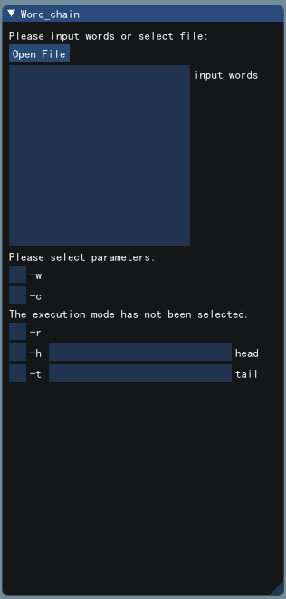
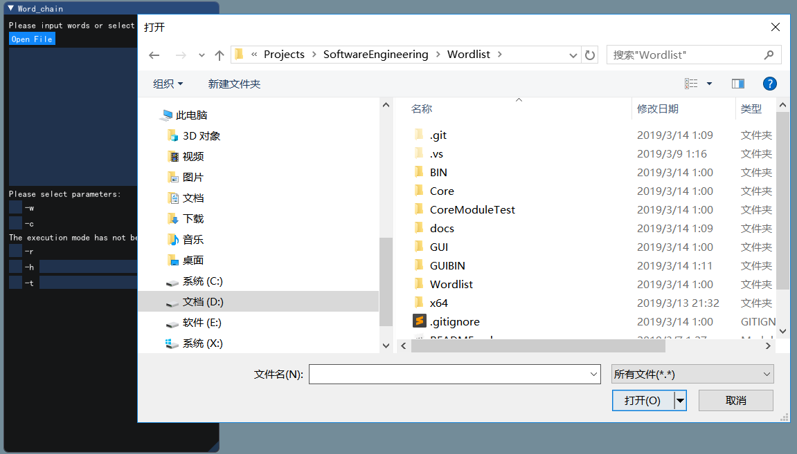
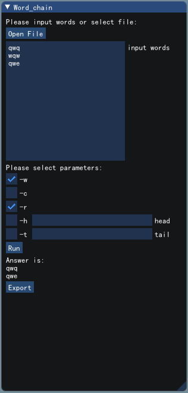
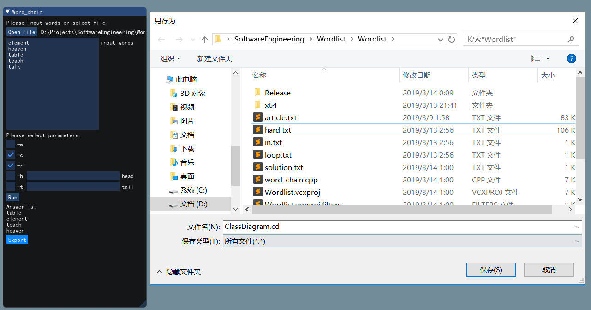

# word_chain

## 图形界面使用说明

直接双击GUIBIN目录下的GUI.exe文件即可启动图形界面。图形界面的功能主要为以下四部分：

1. 输入：包括通过Open File按钮导入文本以及文本框输入文本两种输入方式，导入文件后文件的内容会出现在输入框中；
2. 参数选择：通过参数选择框选择对应的参数，选择的参数发生缺少、冲突 、错误时会实时给出提示信息；
3. 运行：当选择的参数无误后会显示Run按钮，用户点击Run按钮后调用核心模块计算；
4. 输出：点击Run按钮计算完成之后运行结果以及Export按钮显示在按钮下方，点击Export按钮将跳出路径选择窗口，用户选择路径后将结果保存到用户指定的位置。

